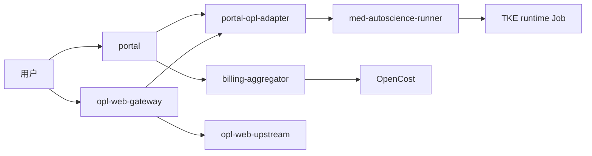

# Portal + OPL TKE 标准集群打包说明

这个包用于把当前 Portal + OPL 接入形态迁移到腾讯云 TKE 标准集群的 staging/pre-prod 环境。

边界说明：

- `manifests/` 是可以渲染后 `kubectl apply` 到 TKE 的 Kubernetes YAML 模板。
- `build/dockerfiles/` 是构建业务镜像的 Dockerfile 模板。
- `source/` 由打包脚本复制，不提交到仓库；用于在云端构建镜像。
- 真实密钥、真实域名、真实镜像地址不会写死在模板里，必须在 `env/tke.env` 中填写。

## 目标拓扑



## 使用步骤

1. 复制环境文件：

```powershell
Copy-Item .\env\tke.env.example .\env\tke.env
```

2. 编辑 `env/tke.env`，至少填写：

- `PORTAL_HOST`
- `OPL_HOST`
- `PORTAL_IMAGE`
- `OPL_ADAPTER_IMAGE`
- `OPL_WEB_GATEWAY_IMAGE`
- `OPL_WEB_IMAGE`
- `BILLING_IMAGE`
- `PRODUCT_RUNTIME_MODE=user_owned`
- `PRODUCT_OPS_PROFILE=0`
- `IMAGE_PULL_SECRET`
- `PORTAL_POSTGRES_URL`
- `PORTAL_REDIS_URL`
- `OPL_LAUNCH_SECRET`
- `PORTAL_ADMIN_PASSWORD`

3. 镜像说明。

当前 TCR 已经按服务拆成 8 个独立私有仓库，`env/tke.env.tcr-gaofenglab.example` 和包内 `env/tke.env` 默认使用这些分仓镜像：

```powershell
uswccr.ccs.tencentyun.com/gaofenglab/portal-opl:opl-v10
uswccr.ccs.tencentyun.com/gaofenglab/portal-opl-adapter-opl:opl-v10
uswccr.ccs.tencentyun.com/gaofenglab/opl-web-gateway-opl:opl-v10
uswccr.ccs.tencentyun.com/gaofenglab/opl-web-opl:opl-v1
uswccr.ccs.tencentyun.com/gaofenglab/billing-aggregator-opl:opl-v10
uswccr.ccs.tencentyun.com/gaofenglab/resource-provisioner-opl:opl-v10
uswccr.ccs.tencentyun.com/gaofenglab/med-autoscience-runner-orchestrator-opl:opl-v10
uswccr.ccs.tencentyun.com/gaofenglab/med-autoscience-runner-opl:opl-v1
```

如需从离线 tar 恢复并重新推送分仓镜像：

```powershell
$env:TCR_PASSWORD="<TCR 访问密码>"
.\scripts\load-and-push-tcr-images.ps1
```

如需从源码重新构建并推送分仓镜像：

```powershell
$env:TCR_PASSWORD="<TCR 访问密码>"
.\scripts\build-and-push-tcr.ps1
```

OPL Web 原生 UI 镜像由脚本从 `opl-aion-shell` 源码构建；构建参考见 `build/dockerfiles/opl-web-upstream.Dockerfile.reference`。

4. 渲染 YAML。

Windows/PowerShell 环境：

```powershell
.\scripts\render-tke-manifests.ps1 -EnvFile .\env\tke.env -TemplateDir .\manifests -OutDir .\rendered
```

WSL/Linux 环境：

```bash
node deploy/tke-package/scripts/render-tke-manifests.mjs \
  --env-file deploy/tke-package/env/tke.env \
  --template-dir deploy/tke-package/manifests \
  --out-dir deploy/tke-package/rendered-local-check
```

如果包里已经存在 `rendered/`，它只代表占位符语法验证产物。正式部署前必须先编辑 `env/tke.env`，再重新渲染到 `rendered-local-check/` 或其他已忽略目录，避免把真实 secret 写入 Git 跟踪文件。

5. 应用到 TKE：

```powershell
kubectl apply -f .\rendered-local-check
kubectl -n portal-staging rollout status deploy/portal
kubectl -n portal-staging rollout status deploy/portal-opl-adapter
kubectl -n portal-staging rollout status deploy/opl-web-gateway
kubectl -n portal-staging rollout status deploy/billing-aggregator
```

6. 验证：

```powershell
.\scripts\verify-tke-smoke.ps1 -Namespace portal-staging -PortalHost <portal.example.com> -OplHost <opl.example.com>
```

工作负载端口和 CPU/内存建议见 `WORKLOAD_SIZING.md`。如果使用 TKE 控制台手动创建工作负载，逐项填写表见 `TKE_CONSOLE_WORKLOAD_FILLING.md`。

可选组件：

- `optional/minio-staging.yaml`：仅用于 staging 自建 MinIO。正式生产优先接 COS 或托管对象存储。
- `optional/opencost-values.yaml`：OpenCost Helm values 参考。
- `optional/managed-runtime-runner-rbac.yaml` 和 `optional/managed-runtime-workloads.yaml`：仅用于 `PRODUCT_RUNTIME_MODE=managed_runtime` 的平台托管 runtime，不属于 v21 user-owned 默认产品链路。
- 可选 YAML 也需要先用同一个渲染脚本替换占位符，再 apply。

## 当前必须知道的限制

- 这是 TKE staging 包，不是直接营业包。
- 默认 user-owned 路径不部署 runner，也不依赖 MinIO；managed-runtime profile 若重新启用 runner，仍需单独处理 MinIO/S3/COS 同步实现。
- `med-autoscience-runner` 仅保留在 optional managed-runtime 清单中；启用前要明确它创建 TKE Job、共享卷和对象存储回传的生产化边界。
- 计费在腾讯云真实账单未回补前只能是 pending，不允许把估算结果当最终扣费。
- `OPL_WEBUI_AUTH_MODE=none` 是短期 launch token 模式；正式营业应升级为 token 换 OPL Web session 或 OIDC trust。
